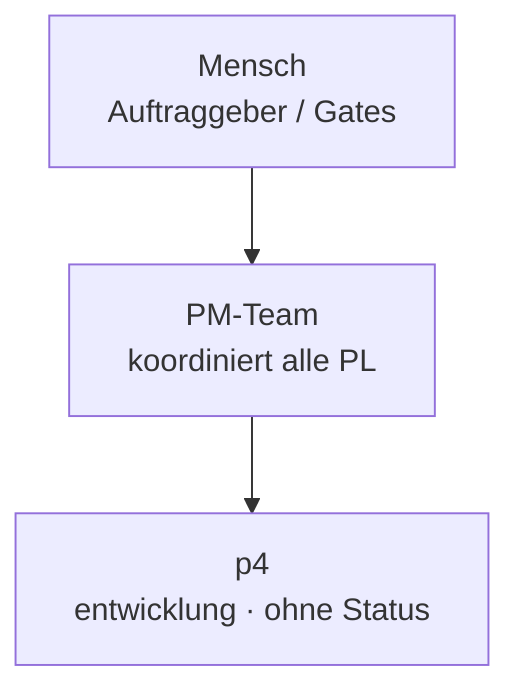

# Organigramm: p4

*Generiert aus den Registries (`process/teams/registry.yaml`, `process/roles/besetzungen.yaml`) durch `platform/scripts/organigramm.py` — **nicht von Hand pflegen**, Änderungen gehören in die Registry (Konzept `process/docs/03-rollenmodell-v2-orga-rework.md` Kap. 8).*

**Auftrag:** Mission Control 3.1: LAN-Betrieb mit PIN, Handy-PWA, Briefkasten-Chat

## Beteiligte

| Instanz | Rolle | Motor | Takt | Status | Quelle | Hinweis |
|---|---|---|---|---|---|---|

Rollen-Bauplan: `process/roles/<rolle>.md` · projektspezifischer Teil: `roles/<rolle>.md` in diesem Repo · Historie: `docs/historie.md`
